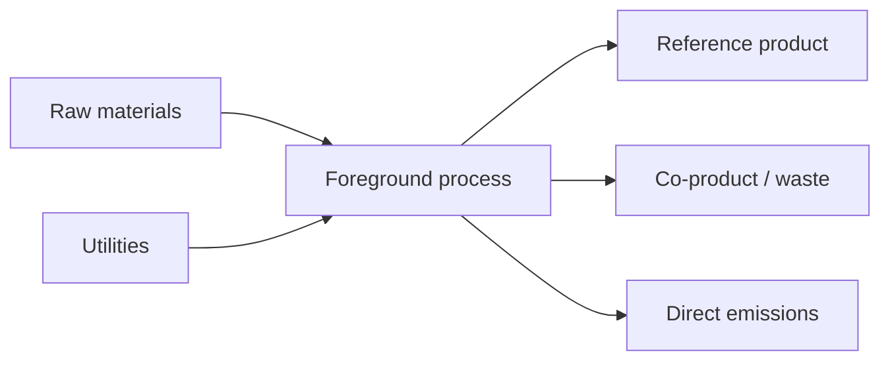

# Process map — {{TITLE}}

**Study ID:** `{{SLUG}}`  
**Updated:** {{DATE}}

## Product-system diagram

Create a diagram or Mermaid flowchart that distinguishes:

- foreground unit processes;
- background providers/markets;
- elementary flows to/from the environment;
- co-products, waste, recovered materials, and treatment functions;
- transport, use, maintenance, and end-of-life stages;
- excluded processes and cutoff rationale.

## Process table

| Process ID | Name | Foreground/background | Function/reference product | Geography | Time | Technology | Data owner/source | Tool object ID | Status |
|---|---|---|---|---|---|---|---|---|---|
| P-001 |  | foreground |  |  |  |  |  |  | planned |

## Boundary interfaces

| Interface ID | Flow | From | To | Amount basis | Unit | Provider rule | Included? | Notes |
|---|---|---|---|---|---|---|---|---|
| I-001 |  |  |  | per functional unit |  |  | yes |  |

## Lifecycle stages and scenarios

| Stage | Included | Baseline scenario | Alternatives | Evidence | Material gaps |
|---|---|---|---|---|---|
| Raw materials |  |  |  |  |  |
| Manufacturing |  |  |  |  |  |
| Distribution |  |  |  |  |  |
| Use/maintenance |  |  |  |  |  |
| End of life |  |  |  |  |  |

## Completeness review

- Missing physical flows:
- Missing life-cycle stages:
- Unlinked background providers:
- Potential duplicate burdens/credits:
- Items below cutoff and cumulative excluded share:
