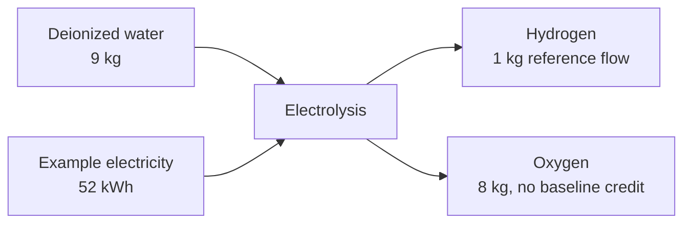

# Process map — Synthetic electrolytic hydrogen screening example

| Process ID | Name | Foreground/background | Function/reference product | Geography | Time | Technology | Status |
|---|---|---|---|---|---|---|---|
| P-EL-001 | Generic electrolysis | foreground | 1 kg hydrogen | Example Region | 2026 scenario | generic | modeled |
| P-WAT-001 | Deionized water supply | background candidate | kg water | Example Region | current | generic | provider pending |
| P-ELE-001 | Electricity supply | background candidate | kWh electricity | Example Region | 2026 scenario | unspecified mix | provider pending |

The provider rows are intentionally pending. The example shows why a physically closed foreground inventory is not yet a calculated LCA.
